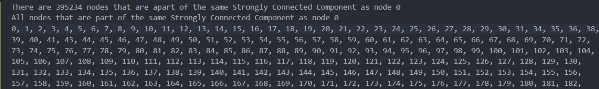
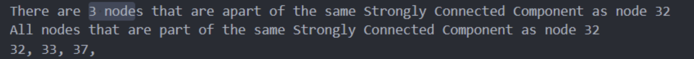
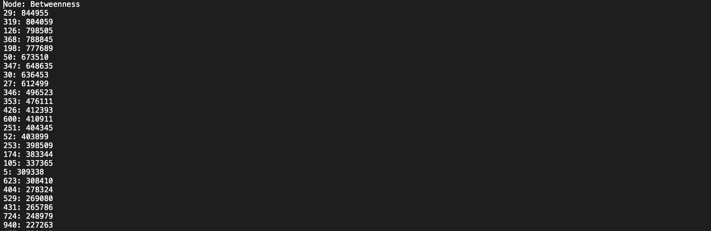
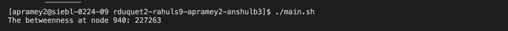

# Results

## Tarjan’s Algorithm for Strongly Connected Components

We performed Tarjan’s algorithm on the graph in order to find all the strongly connected components(SCCs) that the graph has. We had a function that took in two-node ids and returned true if they were a part of the same SCC. We also added a function that prints to a file all of the nodes that are a part of the same SCC as a particular node in line with our project proposal.  

We found out that the graph contains 1588 SCCs. Interestingly nearly all of the nodes(395234/403394) belonged to just one SCC and almost all of the remaining SCCs usually only had a few nodes in them.

This indicates that there exists a two-way path between almost all amazon purchases. In other words, given two items A and B, there is a good chance that there exists a chain of items that are commonly purchased together that connects A to B and another chain that connects B back to A. Therefore, if we had a website that had links to all items that were commonly purchased with a given item(the neighbors of our graph), and a user was to start at item A and click on related items with the goal of getting to item B, there is a very good chance(98%) that they would be able to both get to that item page and back to the item page that they started at again. 

In our project proposal, we had hypothesized that knowing the SCCs of our graph could help us prioritize recommending a commonly purchased item if it was a part of the same SCC as the main item. However, given that around 98% of the nodes in the graph are a part of the same SCC, we wouldn’t be able to prioritize the recommendations too much, and, thus, this feature would not be very useful.

## Brandes’ Algorithm for Betweenness Centrality

We used Brandes' algorithm to calculate the betweenness centrality of every node in the graph that runs in ϴ(ve + v^2logn) on directed graphs.
We wrote an initial method that calculated the betweenness values for each node in the graph and called it in the constructor. To allow us to work with our results, we wrote a method that took a nodeId and returned its computed betweenness value, a method that returned all the betweenness values as a sorted list, and a method that wrote this sorted data to a file.

Unfortunately, when we attempted to run the algorithm on our dataset with 403394 nodes and 3387388 edges, we realized that we would not be able to finish running the algorithm on any of our machines. Instead, we calculated the betweenness values for the first 1000 nodes.

The data shows that among the first 1000 nodes, the amazon products represented by nodes 29, 319, 126, 368, and 198 are particularly important to the graph. Since these nodes lie on several shortest paths between other products, it is clear that they are an important part of the user navigation experience. Further, removing these central products could lead to several other products receiving less user activity.

Checking the betweenness value of a specific node can be very useful to identify whether a product is performing satisfactorily.
